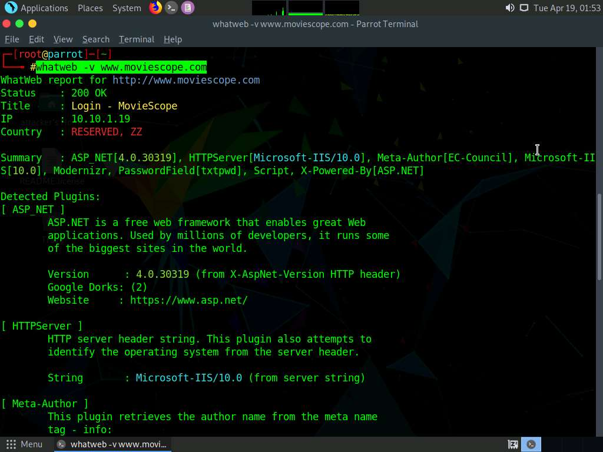
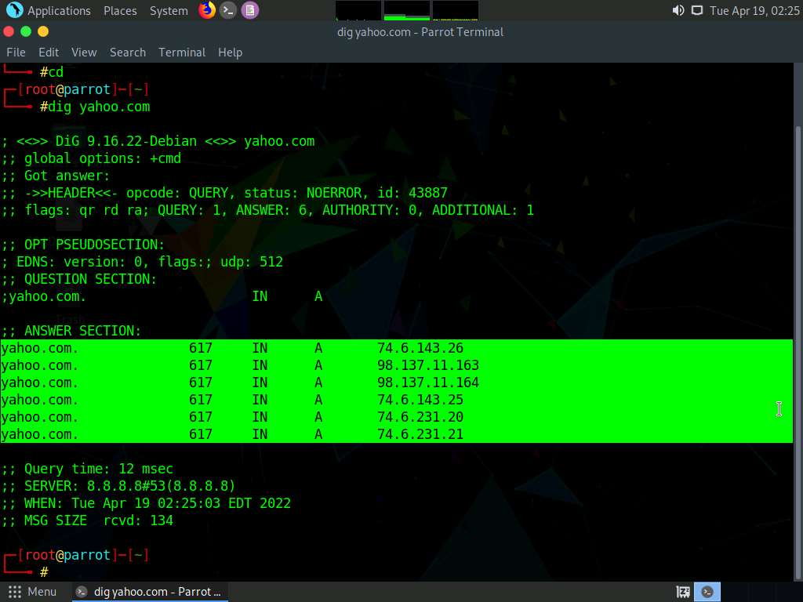
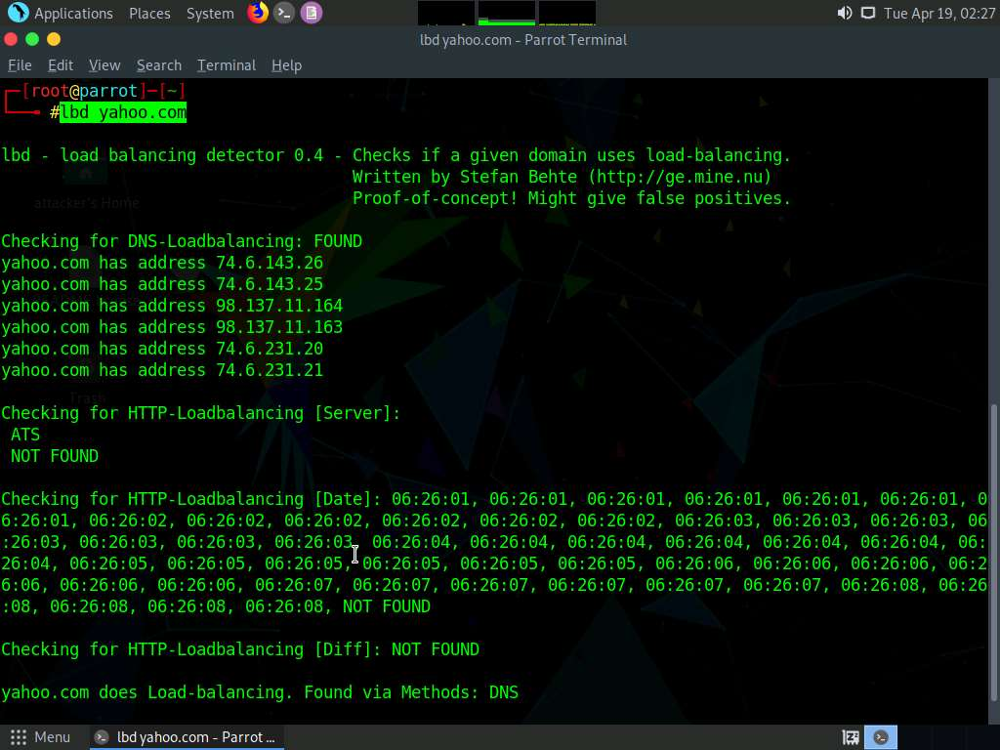
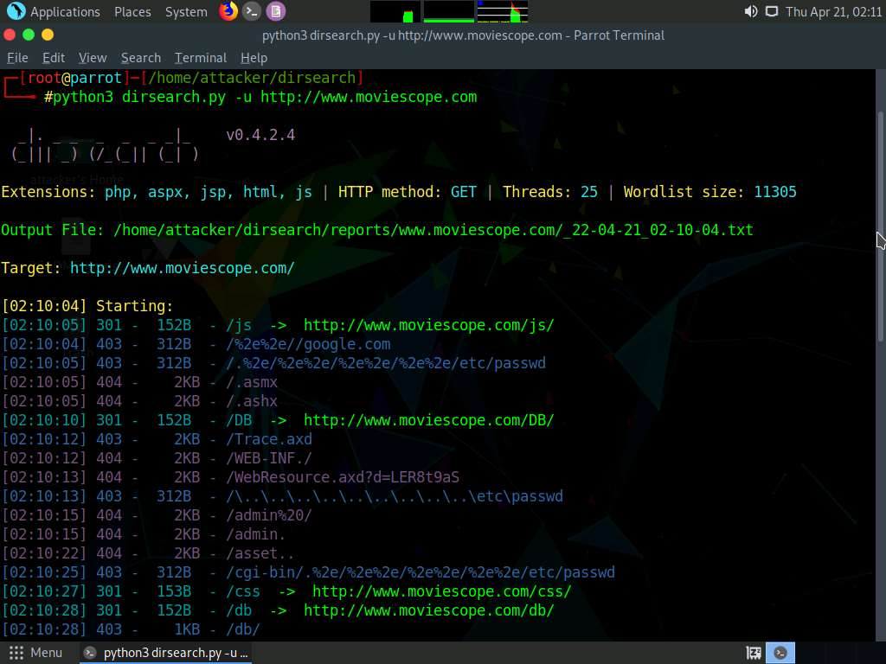

# CEH-Tool

[create an anchor](#anchors-in-markdown)

https://whatcms.org/ - get the CMS or Framework of website. Found and returns social networks also. #detect 

Steghide
□ Платформа: любая
Рис. 4.3. После и до
□ Где скачивать: GitHub(https://github.com/StefanoDeVuono/steghide)
Steghide - консольная утилита, написанная на С++. Скрывает информацию в стан­ дартных файлах форматов JPEG, ВМР, WAV и AU. В арсенале программы полно шифров - даже Blowfish, которого я у других не замечал. Теоретически использо­ вание такой экзотики может помочь запутать следы еще сильнее.
Steghide умеет не просто упаковывать данные в картинку или трек, а еще и шифро­ вать секретную нагрузку.
Но есть и минус: не все фотографии и аудиофайлы подойдут для внедрения в них секретной нагрузки. Если файл слишком маленький - внедрить в него ничего нельзя.
Давай попробуем объединить картинку cats. jpg и секретный файлик save. txt. Открываем терминал и пишем:
steghide emЬed -cf cats.jpg -ef save.txt
□ emЬedfile [-efJ - файл, который мы будем встраивать;
□ coverfile [ -cf] - файл-обложка, в который внедряется секретная инфа;
г-ак1 1
Отмена
f rПр-....тъJ

□-- 60 --□
□ compress [-z J - сжимать данные перед упаковкой; □ encryption [-eJ - шифровать внедряемые данные. Распаковка так же проста, как упаковка:
steghide extract -sf cats.jpg

# Footprint the Web Infrastructure
## Perform Web Application Reconnaissance using Nmap and Telnet
Use tools such as Netcraft (https://www.netcraft.com), SmartWhois (https://www.tamos.com), WHOIS Lookup (https://whois.domaintools.com), and Batch IP Converter (http://www.sabsoft.com) to perform the Whois lookup.
Use tools such as, DNSRecon (https://github.com), and DNS Records (https://network-tools.com), Domain Dossier (https://centralops.net) to perform DNS interrogation.

```nmap -T4 -A -v [Target Web Application]``` - The result appears, displaying the open ports and services running on the machine hosting the target website.

## Perform Web Application Reconnaissance using WhatWeb
```whatweb -v [Target Web Application]``` - The result appears, displaying a detailed report on the target website such as its IP address, plugin information, and HTTP header information, as shown in the screenshot.



OWASP Zed Attack Proxy (ZAP) is an integrated penetration testing tool for finding vulnerabilities in web applications. In the Terminal window, type ```zaproxy``` and press Enter to launch OWASP ZAP.

## Detect Load Balancers using Various Tools
```dig yahoo.com``` - The result appears, displaying the available load balancers of the target website, as the screenshot demonstrates. Here, a single host resolves to multiple IP addresses, which possibly indicates that the host is using a load balancer.


```lbd yahoo.com``` - The result appears, displaying the available DNS load balancers used by the target website, as shown in the screenshot.


## Identify Web Server Directories using Various Tools
```nmap -sV --script=http-enum [target domain or IP address]``` - The result appears, displaying open ports and services, along with their version.

```python3 dirsearch.py -u http://www.moviescope.com``` https://github.com/maurosoria/dirsearch - 



# Identify XSS Vulnerabilities in Web Applications using PwnXSS
```python3 pwnxss.py -u http://testphp.vulnweb.com``` https://github.com/pwn0sec/PwnXSS